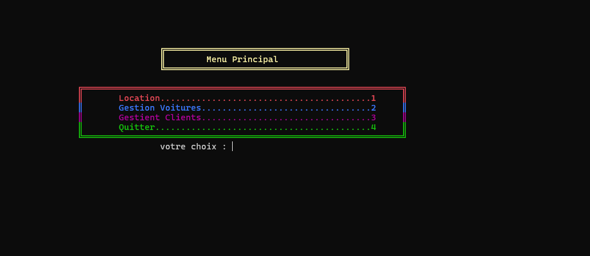

# CarRentalManager

CarRentalManager est une application en langage C conçue pour gérer les voitures de location. Cette application permet de gérer l'inventaire des véhicules, les clients, les locations et les retours.

## Fonctionnalités

- Ajouter, modifier et supprimer des véhicules dans l'inventaire.
- Gérer les informations des clients.
- Enregistrer les locations et les retours de véhicules.
- Générer des rapports sur les véhicules disponibles et les historiques de location.

## Installation

1. Clonez ce dépôt sur votre machine locale :
    ```sh
    git clone https://github.com/youssefhajaj/CarRentalManager.git
    ```

2. Accédez au dossier du projet :
    ```sh
    cd CarRentalManager/projet
    ```

## Utilisation

1. Assurez-vous que le fichier `projet.exe` se trouve dans le dossier `projet`.

2. Exécutez l'application :
    - Sous Windows :
        Double-cliquez sur `projet.exe` ou exécutez la commande suivante dans votre terminal :
        ```sh
        .\projet.exe
        ```

## Contribuer

Les contributions sont les bienvenues ! Pour contribuer :

1. Forkez ce dépôt.
2. Créez une branche pour votre fonctionnalité ou correction de bug (`git checkout -b feature/nom-de-la-branche`).
3. Commitez vos modifications (`git commit -m 'Ajout d'une fonctionnalité'`).
4. Poussez votre branche (`git push origin feature/nom-de-la-branche`).
5. Ouvrez une Pull Request.

## Licence

Ce projet est sous licence MIT. Voir le fichier [LICENSE](LICENSE) pour plus de détails.

## Acknowledgements

Merci à tous les contributeurs et utilisateurs de CarRentalManager !

---

*Projet réalisé dans le cadre de l'apprentissage du langage C.*


